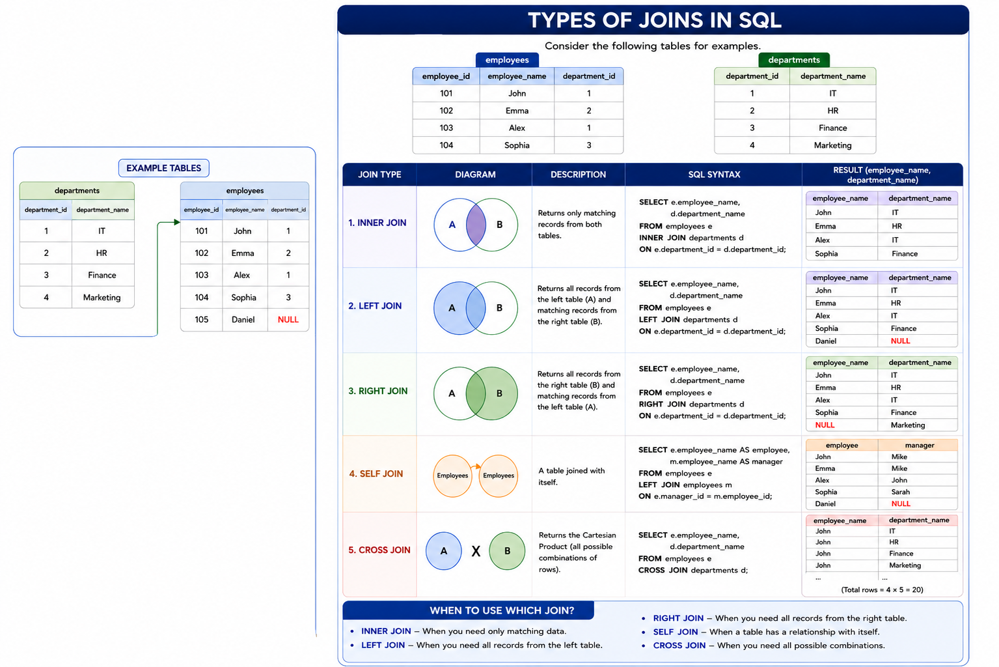

# 🔗 Part 3: JOINs in MySQL

> Combine data from multiple tables using a shared key — the backbone of relational databases.

---

## 📌 What is a JOIN?

A **JOIN** clause is used to combine rows from two or more tables based on a **related column** between them. Instead of storing all data in one giant table, relational databases split data into logical tables and use JOINs to stitch them back together at query time.

```sql
-- Basic pattern
SELECT columns
FROM table_A
JOIN table_B ON table_A.key = table_B.key
```

---

## 🗺️ Types of JOINs — Visual Reference



| JOIN Type | Returns | Use When |
|-----------|---------|----------|
| `INNER JOIN` | Only matching rows in **both** tables | You only care about records with a match on both sides |
| `LEFT JOIN` | All rows from **left** table + matched rows from right (NULL if no match) | You want every left-side record, even if the right side has nothing |
| `RIGHT JOIN` | All rows from **right** table + matched rows from left (NULL if no match) | You want every right-side record, even if the left side has nothing |
| `FULL OUTER JOIN` | All rows from **both** tables (NULL where no match) | You want a complete picture regardless of matches |
| `SELF JOIN` | A table joined with **itself** | Hierarchical data like employee → manager relationships |
| `CROSS JOIN` | Every row of left × every row of right (Cartesian product) | Generating all combinations (rare in practice) |

---

## 🧱 Database Schema (Context)

The queries below operate on these tables:

```
employees        bonuses          projects         employee_projects    clients    orders_data
───────────      ────────         ────────         ─────────────────    ───────    ──────────
employee_id  ←── employee_id      project_id  ←── project_id           client_id ←── client_id
employee_name    bonus_amount     project_name     employee_id ──→ employees
email            bonus_date       ...              role
manager_id ──┐   bonus_id
employment_status
              └──→ employee_id (self-reference for manager)
```

---

## 📋 Queries

---

### Q1 — Employee Name, Bonus Amount & Bonus Date

```sql
SELECT e.employee_name, b.bonus_amount, b.bonus_date
FROM employees e
INNER JOIN bonuses b
ON e.employee_id = b.employee_id;
```

**🔍 Explanation:**
Uses an `INNER JOIN` between `employees` and `bonuses` on the shared `employee_id` key. Only employees **who have received at least one bonus** appear in the result — if an employee has no bonus record, they're excluded entirely.

---

### Q2 — Employee Name, Project Name & Role

```sql
SELECT e.employee_name, ep.role, ep.project_id, p.project_name
FROM employees e
INNER JOIN employee_projects ep ON e.employee_id = ep.employee_id
INNER JOIN projects p           ON ep.project_id = p.project_id;
```

**🔍 Explanation:**
A **chained (multi-table) INNER JOIN** across three tables. `employee_projects` is the bridge/junction table linking employees to projects. The first join connects employees to their project assignments; the second join enriches that with the actual project name from the `projects` table. Only employees assigned to at least one project are returned.

---

### Q3 — Employees with Bonus Greater than ₹10,000

```sql
SELECT e.employee_name  AS employerName,
       e.email          AS employeeEmail,
       b.bonus_amount   AS bonusAmount
FROM employees e
INNER JOIN bonuses b ON e.employee_id = b.employee_id
WHERE b.bonus_amount > 10000;
```

**🔍 Explanation:**
Same `INNER JOIN` as Q1, but filtered with a `WHERE` clause to keep only high-value bonuses. Column aliases (`AS`) make the output cleaner and more readable. The filter runs **after** the join, so only matched rows that also satisfy the amount condition are returned.

---

### Q4 — Employees On Leave with Their Manager Names

```sql
SELECT e.employee_name  AS employeName,
       m.employee_name  AS managerName,
       e.employment_status
FROM employees e
INNER JOIN employees m ON e.manager_id = m.employee_id
WHERE e.employment_status = 'On Leave';
```

**🔍 Explanation:**
A **SELF JOIN** — the `employees` table is joined to **itself**. The same table is aliased twice: `e` for the employee and `m` for the manager. The join condition `e.manager_id = m.employee_id` links each employee to their manager within the same table. The `WHERE` clause then filters to only show employees currently on leave.

---

### Q5 — Employees Who Never Received a Bonus

```sql
SELECT e.employee_name AS employerName,
       b.bonus_id      AS bonus_id,
       b.bonus_amount
FROM employees e
LEFT JOIN bonuses b ON e.employee_id = b.employee_id
WHERE b.bonus_id IS NULL;
```

**🔍 Explanation:**
Classic **anti-join pattern** using `LEFT JOIN` + `IS NULL`. A `LEFT JOIN` keeps all employees regardless of whether they have a bonus record. Where no bonus exists, the bonus columns come back as `NULL`. The `WHERE b.bonus_id IS NULL` filter then isolates exactly those employees — the ones with **no bonus at all**.

---

### Q6 — All Managers with Their Direct Reports (Including Managers with No Reports)

```sql
SELECT m.employee_name AS managerName, e.employee_name AS employeeName
FROM employees m 
LEFT JOIN employees e 
ON m.employee_id = e.manager_id 
WHERE m.employee_id IN(
	SELECT DISTINCT employee_id
	FROM employees 
	WHERE manager_id IS NULL
)
```

**🔍 Explanation:**
Another **SELF JOIN**, but with `LEFT JOIN` to ensure managers with zero direct reports still appear. The subquery in the `WHERE` clause restricts results to only employees who are actually managers (i.e., someone else has their `employee_id` as their `manager_id`). Employees under them are listed alongside — if a manager has no reportees, `employeeName` will be `NULL`.

---

### Q7 — Employees Working on More Than One Project

```sql
SELECT e.employee_name,
       COUNT(ep.project_id) AS total_project
FROM employees e
INNER JOIN employee_projects ep ON e.employee_id = ep.employee_id
GROUP BY e.employee_id
HAVING COUNT(ep.project_id) > 1;
```

**🔍 Explanation:**
Joins employees with their project assignments, then **aggregates with `GROUP BY`** to count projects per employee. The key distinction here: `WHERE` filters rows before grouping, but `HAVING` filters **after** aggregation — which is why we use `HAVING COUNT(...) > 1` to find multi-project employees. Only employees with 2+ projects make the cut.

---

### Q8 — Employees Not Assigned to Any Project

```sql
SELECT e.employee_name, ep.project_id
FROM employees e
LEFT JOIN employee_projects ep ON e.employee_id = ep.employee_id
WHERE ep.project_id IS NULL;
```

**🔍 Explanation:**
Mirror of Q5 but for projects. `LEFT JOIN` keeps every employee; when `employee_projects` has no matching row, `ep.project_id` is `NULL`. The `WHERE` clause filters to only those unassigned employees. A quick way to spot resource allocation gaps.

---

### Q9 — Projects with No Employees Assigned

```sql
SELECT p.project_id,
       p.project_name
FROM projects p
LEFT JOIN employee_projects ep ON p.project_id = ep.project_id
WHERE ep.project_id IS NULL;
```

**🔍 Explanation:**
Flip side of Q8 — now the **project is the "left" table**. `LEFT JOIN` ensures all projects appear even without matching entries in `employee_projects`. The `IS NULL` filter isolates projects with zero assigned staff — useful for identifying unmanned or stalled projects.

---

### Q10 — Clients with Total Number of Orders

```sql
SELECT c.client_name,
       COUNT(c.client_id) AS total_number_Orders
FROM clients c
LEFT JOIN orders_data o ON c.client_id = o.client_id
GROUP BY c.client_id;
```

**🔍 Explanation:**
`LEFT JOIN` ensures **all clients appear** even if they've placed zero orders. `COUNT(c.client_id)` counts the number of rows grouped per client — clients with no orders will show `0` (since `c.client_id` is never NULL, unlike `o.client_id`). A `RIGHT JOIN` or `INNER JOIN` here would silently drop clients with no orders.

> 💡 **Tip:** Use `COUNT(o.order_id)` instead of `COUNT(c.client_id)` if you want to strictly count order records and get `0` for clients with no orders, rather than counting the client row itself.

---

## 🧠 Quick Decision Guide

```
Do I want only matched rows?          → INNER JOIN
Do I want all rows from left table?   → LEFT JOIN
Do I want all rows from right table?  → RIGHT JOIN
Is the table referencing itself?      → SELF JOIN (alias the table twice)
Do I want unmatched rows only?        → LEFT JOIN + WHERE right.key IS NULL
```

---
